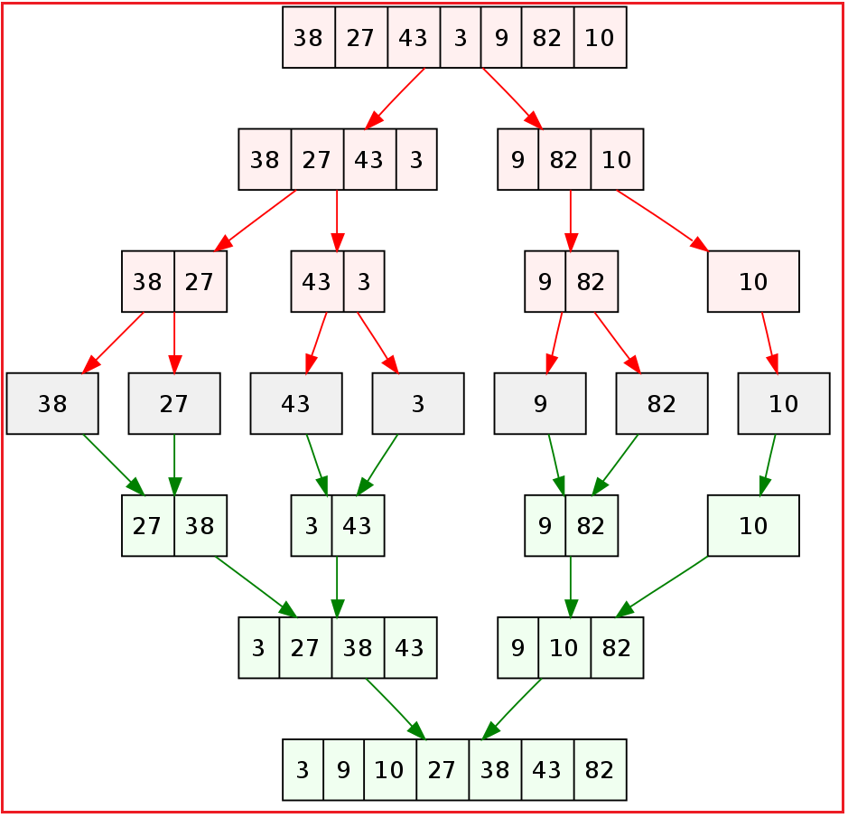
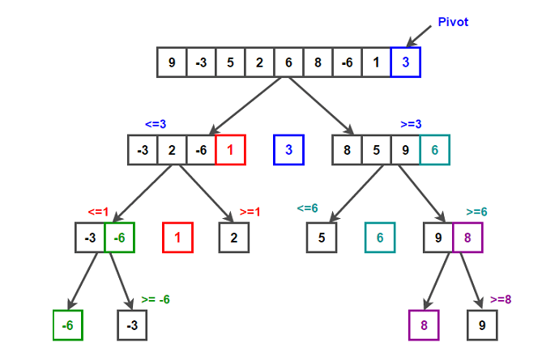

Data Structures and Algorithms using Python
===========================================

A computer program is a collection of instructions to perform a specific task. For this, a computer program may need to store data, retrieve data, and perform computations on the data.
A Data Structure is a named location that can be used to store and organize data. And, an algorithm is a collection of steps to solve a particular problem. Learning data structures and algorithms allow us to write efficient and optimized computer programs.

Data Structures are the programmatic way of storing data so that data can be used efficiently. Almost every enterprise application uses various types of data structures in one or the other way. This tutorial will give you a great understanding on Data Structures needed to understand the complexity of enterprise level applications and need of algorithms, and data structures.

Applications of Data Structure and Algorithms:
----------------------------------------------

Algorithm is a step-by-step procedure, which defines a set of instructions to be executed in a certain order to get the desired output. Algorithms are generally created independent of underlying languages, i.e. an algorithm can be implemented in more than one programming language.

From the data structure point of view, following are some important categories of algorithms −

  - Search − Algorithm to search an item in a data structure.
  - Sort − Algorithm to sort items in a certain order.
  - Insert − Algorithm to insert item in a data structure.
  - Update − Algorithm to update an existing item in a data structure.
  - Delete − Algorithm to delete an existing item from a data structure.

The following computer problems can be solved using Data Structures:

  - Fibonacci number series
  - Knapsack problem
  - Tower of Hanoi
  - All pair shortest path by Floyd-Warshall
  - Shortest path by Dijkstra
  - Project scheduling
  - And Many More

# Algorithm Implementation in Python

List of Algorithms in Python contained in this repository

  - [Addition Without Operator](https://github.com/Aditya-Kashyap/DSA_using_Python/tree/main/DSA/AdditionWithoutOperator)
  - [Arrays](https://github.com/Aditya-Kashyap/DSA_using_Python/tree/main/DSA/Arrays)
  - [Automata](https://github.com/Aditya-Kashyap/DSA_using_Python/tree/main/DSA/Automata)
  - [Backtracking](https://github.com/Aditya-Kashyap/DSA_using_Python/tree/main/DSA/BackTrackingAlgorithms)
  - [Bitwise](https://github.com/Aditya-Kashyap/DSA_using_Python/tree/main/DSA/BitOperations)
  - [Breath First Search](https://github.com/Aditya-Kashyap/DSA_using_Python/tree/main/DSA/BreathFirstSearch)
  - [Compression](https://github.com/Aditya-Kashyap/DSA_using_Python/tree/main/DSA/Compression)
  - [Deep Learning](https://github.com/Aditya-Kashyap/DSA_using_Python/tree/main/DSA/DeepLearningAlgorithms)
  - [Distribution](https://github.com/Aditya-Kashyap/DSA_using_Python/tree/main/DSA/Distribution)
  - [Depth First Search](https://github.com/Aditya-Kashyap/DSA_using_Python/tree/main/DSA/DepthFirstSearch)
  - [Divide And Conquer](https://github.com/Aditya-Kashyap/DSA_using_Python/tree/main/DSA/DivideAndConquer)
  - [Dynamic Programing](https://github.com/Aditya-Kashyap/DSA_using_Python/tree/main/DSA/DynamicPrograming)
  - [Eularian Path](https://github.com/Aditya-Kashyap/DSA_using_Python/tree/main/DSA/EularianPathAlgorithms)
  - [Graphs](https://github.com/Aditya-Kashyap/DSA_using_Python/tree/main/DSA/Graph)
  - [Heaps](https://github.com/Aditya-Kashyap/DSA_using_Python/tree/main/DSA/Heaps)
  - [Linked List](https://github.com/Aditya-Kashyap/DSA_using_Python/tree/main/DSA/Linkedlist)
  - [Machine Learning Algorithms](https://github.com/Aditya-Kashyap/DSA_using_Python/tree/main/DSA/MachineLearningAlgorithms)
  - [Map](https://github.com/Aditya-Kashyap/DSA_using_Python/tree/main/DSA/Map)
  - [Maths](https://github.com/Aditya-Kashyap/DSA_using_Python/tree/main/DSA/Math)
  - [Matrix](https://github.com/Aditya-Kashyap/DSA_using_Python/tree/main/DSA/Matrix)
  - [Path Finding Algorithms](https://github.com/Aditya-Kashyap/DSA_using_Python/tree/main/DSA/PathFindingAlgorithms)
  - [Permutation of Strings](https://github.com/Aditya-Kashyap/DSA_using_Python/tree/main/DSA/Permutations_of_string)
  - [Priority Queue DS](https://github.com/Aditya-Kashyap/DSA_using_Python/tree/main/DSA/PriorityQueueDS)
  - [Queues](https://github.com/Aditya-Kashyap/DSA_using_Python/tree/main/DSA/Queues)
  - [Recursion Algorithms](https://github.com/Aditya-Kashyap/DSA_using_Python/tree/main/DSA/RecursionAlgorithms)
  - [Searching Algorithms](https://github.com/Aditya-Kashyap/DSA_using_Python/tree/main/DSA/SearchingAlgorithms)
  - [Sets](https://github.com/Aditya-Kashyap/DSA_using_Python/tree/main/DSA/Set)
  - [Sieve Algorithms](https://github.com/Aditya-Kashyap/DSA_using_Python/tree/main/DSA/SieveAlgorithms)
  - [Sorting Algorithms](https://github.com/Aditya-Kashyap/DSA_using_Python/tree/main/DSA/SortingAlgorithms)
  - [Stack](https://github.com/Aditya-Kashyap/DSA_using_Python/tree/main/DSA/Stack)
  - [Strings](https://github.com/Aditya-Kashyap/DSA_using_Python/tree/main/DSA/Strings)
  - [Svg](https://github.com/Aditya-Kashyap/DSA_using_Python/tree/main/DSA/Svg)
  - [Tests](https://github.com/Aditya-Kashyap/DSA_using_Python/tree/main/DSA/Tests)
  - [Trees](https://github.com/Aditya-Kashyap/DSA_using_Python/tree/main/DSA/Trees)
  - [UnionFind](https://github.com/Aditya-Kashyap/DSA_using_Python/tree/main/DSA/UnionFind)
  - [Unix](https://github.com/Aditya-Kashyap/DSA_using_Python/tree/main/DSA/Unix)

### Backtracking Algorithms:
Backtracking is a technique for solving problems recursively by trying to build a solution incrementally, one piece at a time, removing those solutions that fail to satisfy the constraints of the problem at any point of time.
 Example of implementation- Soduku solving.

### Deep Learning Algorithms:
Deep learning is part of machine learning, whose methods are based on artificial neural networks with representation learning. Learning can be supervised, semi-supervised or unsupervised.
Examples include- CNN, RNN, LSTM, GAN, RBM, etc.

### Divide And Conquer:
Divide and Conquer is an algorithm design paradigm based on multi-branched recursion. A divide-and-conquer algorithm works by recursively breaking down a problem into two or more sub-problems of the same or related type, until these become simple enough to be solved directly.
Example of implementation- Quick Sort, Merge Sort.

### Dynamic Programing:
Dynamic Programming is primarily an optimization over plain recursion. Wherever we see a recursive solution that has repeated calls for same inputs, we can optimize it using Dynamic Programming. The idea is to store the results of subproblems, so that we do not have to re-compute them when needed later.
Examples of implementation- Knapsack, Longest Common Subsequence.

### Greedy Algorithms:
A greedy algorithm is a simple, intuitive algorithm that is used in optimization problems. The algorithm makes the optimal choice at each step as it attempts to find the overall optimal way to solve the entire problem.
Examples of implementation- Kruskal's algorithm, Prim's algorithm.

### Machine Learning Algorithms:
A machine learning algorithm is a method that provides systems the ability to automatically learn and improve from experience without being explicitly programmed.
Examples include- Linear Regression, Logistic Regression, Naïve Bayes, KNN, etc

### Path Finding Algorithms:
Pathfinding or pathing is the plotting, by a computer application, of the shortest route between two points. It is a more practical variant on solving mazes.
Example of implemntation- A* search, Dijkstra's algorithm.

### Recursion Algorithms:
Recursion is a method of solving a problem where the solution depends on solutions to smaller instances of the same problem. Such problems can generally be solved by iteration, but this needs to identify and index the smaller instances at programming time.
Examples of implementation- Tower of Hanoi, Tree traversals, DFS.

### Searching Algorithms:
The searching algorithms are used to search or find one or more than one element from a dataset. These type of algorithms are used to find elements from a specific data structures, which maybe sequential or not.
Examples of implementation- Binary Search, Linear Search, Fibonacci Search.

### Sorting Algorithms:
A Sorting algorithm is an algorithm that puts elements of a list in a certain order. The most frequently used orders are numerical order and lexicographical order. Efficient sorting is important for optimizing the efficiency of other algorithms that require input data to be in sorted lists.
Examples of implementation- Quick Sort, Merge Sort.

### Finding all permutation:
In mathematics, a permutation of a set is, loosely speaking, an arrangement of its members into a sequence or linear order, or if the set is already ordered, a rearrangement of its elements. The word "permutation" also refers to the act or process of changing the linear order of an ordered set.
Examples of implementation-Input :  str = 'ABC'  Output : ABC,ACB,BAC,BCA,CAB,CBA

### Spiral Matrix:
The Spiral Matrix problem takes a 2-Dimensional array of N-rows and M-columns as an input, and prints the elements of this matrix in spiral order. The spiral begins at the top left corner of the input matrix, and prints the elements it encounters, while looping towards the center of this matrix, in a clockwise manner.

## Data Structures:
-------------------

 * Queues
 * Stacks
 * Doubly Linked Lists
 * Singly Linked Lists
 * Binary Search Trees
 * Tree Traversal
 * Sortings
 * Searchings
 * Dynamic Programming
 * Heap
 * Graph
 
### Queues
 * Should have the methods: `enqueue`, `dequeue`, and `len`.
   * `enqueue` should add an item to the back of the queue.
   * `dequeue` should remove and return an item from the front of the queue.
   * `len` returns the number of items in the queue.
   

### Doubly Linked Lists
 * The `ListNode` class, which represents a single node in the doubly-linked list, has already been implemented for you. Inspect this code and try to understand what it is doing to the best of your ability.
 * The `DoublyLinkedList` class itself should have the methods: `add_to_head`, `add_to_tail`, `remove_from_head`, `remove_from_tail`, `move_to_front`, `move_to_end`, `delete`, and `get_max`.
   * `add_to_head` replaces the head of the list with a new value that is passed in.
   * `add_to_tail` replaces the tail of the list with a new value that is passed in.
   * `remove_from_head` removes the head node and returns the value stored in it.
   * `remove_from_tail` removes the tail node and returns the value stored in it.
   * `move_to_front` takes a reference to a node in the list and moves it to the front of the list, shifting all other list nodes down. 
   * `move_to_end` takes a reference to a node in the list and moves it to the end of the list, shifting all other list nodes up. 
   * `delete` takes a reference to a node in the list and removes it from the list. The deleted node's `previous` and `next` pointers should point to each afterwards.
   * `get_max` returns the maximum value in the list. 
 * The `head` property is a reference to the first node and the `tail` property is a reference to the last node.
 

### Binary Search Trees
* Should have the methods `insert`, `contains`, `get_max`.
  * `insert` adds the input value to the binary search tree, adhering to the rules of the ordering of elements in a binary search tree.
  * `contains` searches the binary search tree for the input value, returning a boolean indicating whether the value exists in the tree or not.
  * `get_max` returns the maximum value in the binary search tree.
  * `for_each` performs a traversal of _every_ node in the tree, executing the passed-in callback function on each tree node value. There is a myriad of ways to perform tree traversal; in this case any of them should work. 

### Heaps
* Should have the methods `insert`, `delete`, `get_max`, `_bubble_up`, and `_sift_down`.
  * `insert` adds the input value into the heap; this method should ensure that the inserted value is in the correct spot in the heap
  * `delete` removes and returns the 'topmost' value from the heap; this method needs to ensure that the heap property is maintained after the topmost element has been removed. 
  * `get_max` returns the maximum value in the heap _in constant time_.
  * `get_size` returns the number of elements stored in the heap.
  * `_bubble_up` moves the element at the specified index "up" the heap by swapping it with its parent if the parent's value is less than the value at the specified index.
  * `_sift_down` grabs the indices of this element's children and determines which child has a larger value. If the larger child's value is larger than the parent's value, the child element is swapped with the parent.

### Sorting

## Some Useful Information:

### Big O Notation

*Big O notation* is used to classify algorithms according to how their running time or space requirements grow as the input size grows.
On the chart below you may find most common orders of growth of algorithms specified in Big O notation.

Source: [Big O Cheat Sheet](http://bigocheatsheet.com/).

Below is the list of some of the most used Big O notations and their performance comparisons against different sizes of the input data.

| Big O Notation | Computations for 10 elements | Computations for 100 elements | Computations for 1000 elements  |
| -------------- | ---------------------------- | ----------------------------- | ------------------------------- |
| **O(1)**       | 1                            | 1                             | 1                               |
| **O(log N)**   | 3                            | 6                             | 9                               |
| **O(N)**       | 10                           | 100                           | 1000                            |
| **O(N log N)** | 30                           | 600                           | 9000                            |
| **O(N^2)**     | 100                          | 10000                         | 1000000                         |
| **O(2^N)**     | 1024                         | 1.26e+29                      | 1.07e+301                       |
| **O(N!)**      | 3628800                      | 9.3e+157                      | 4.02e+2567                      |

### Data Structure Operations Complexity

| Data Structure          | Access    | Search    | Insertion | Deletion  | Comments  |
| ----------------------- | :-------: | :-------: | :-------: | :-------: | :-------- |
| **Array**               | 1         | n         | n         | n         |           |
| **Stack**               | n         | n         | 1         | 1         |           |
| **Queue**               | n         | n         | 1         | 1         |           |
| **Linked List**         | n         | n         | 1         | n         |           |
| **Hash Table**          | -         | n         | n         | n         | In case of perfect hash function costs would be O(1) |
| **Binary Search Tree**  | n         | n         | n         | n         | In case of balanced tree costs would be O(log(n)) |
| **B-Tree**              | log(n)    | log(n)    | log(n)    | log(n)    |           |
| **Red-Black Tree**      | log(n)    | log(n)    | log(n)    | log(n)    |           |
| **AVL Tree**            | log(n)    | log(n)    | log(n)    | log(n)    |           |
| **Bloom Filter**        | -         | 1         | 1         | -         | False positives are possible while searching |

### Array Sorting Algorithms Complexity

| Name                  | Best            | Average             | Worst               | Memory    | Stable    | Comments  |
| --------------------- | :-------------: | :-----------------: | :-----------------: | :-------: | :-------: | :-------- |
| **Bubble sort**       | n               | n2       | n2       | 1         | Yes       |           |
| **Insertion sort**    | n               | n2       | n2       | 1         | Yes       |           |
| **Selection sort**    | n2   | n2       | n2       | 1         | No        |           |
| **Heap sort**         | n&nbsp;log(n)   | n&nbsp;log(n)       | n&nbsp;log(n)       | 1         | No        |           |
| **Merge sort**        | n&nbsp;log(n)   | n&nbsp;log(n)       | n&nbsp;log(n)       | n         | Yes       |           |
| **Quick sort**        | n&nbsp;log(n)   | n&nbsp;log(n)       | n2       | log(n)    | No        | Quicksort is usually done in-place with O(log(n)) stack space |
| **Shell sort**        | n&nbsp;log(n)   | depends on gap sequence   | n&nbsp;(log(n))2  | 1         | No         |           |
| **Counting sort**     | n + r           | n + r               | n + r               | n + r     | Yes       | r - biggest number in array |
| **Radix sort**        | n * k           | n * k               | n * k               | n + k     | Yes       | k - length of longest key |

## Contributing
Thanks for your interest in contributing! There are many ways to contribute to this project. [Get started here](CONTRIBUTING.md)
